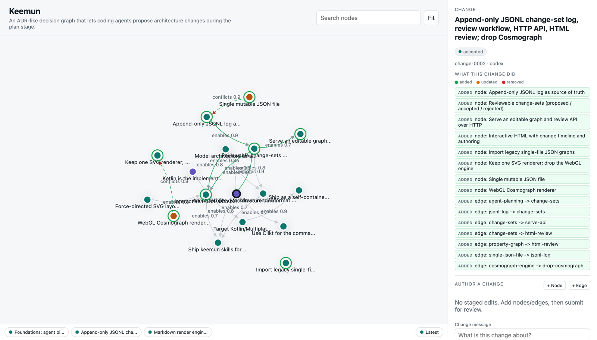

# keemun

> An experimental, ADR-like system that lets coding agents propose architecture
> changes as a first-class part of the **plan** stage.

[](#)
[](LICENSE)
[](#install)

When an agent plans a non-trivial change, the *architecture* decision usually
stays implicit — buried in a chat log and lost the moment the session ends.
keemun makes it explicit. It models your decisions, constraints, options, and
outcomes as a **property graph** with first-class rationale on every edge, so an
agent can reason about architecture the way it reasons about code: read it,
change it, and leave a durable record of *why*.

Think of it as Architecture Decision Records, but as a living graph an agent can
query and edit during planning — not a folder of stale Markdown.



<p align="center"><em>keemun's own architecture, recorded as a keemun graph. Pick a change-set in the timeline to see exactly what it added (green), updated (amber), or removed (red).</em></p>

## How agents use it

keemun ships with a **keemun skill for Claude Code and Codex** that teaches them
the full loop:

1. **Review** the existing architecture graph.
2. **Propose** changes during the plan stage.
3. **Apply or reject** each proposal — straight from the CLI.

The result is a reviewable, versionable trail of architectural intent that
travels with the repo instead of evaporating between sessions.

## Install

**Homebrew** (macOS & Linux):

```bash
brew install heapy/tap/keemun
```

**GitHub Releases** — download a native binary for your platform from the
[Releases page](https://github.com/Heapy/keemun/releases), extract, and put it on
your `PATH`:

| Platform | Asset |
| --- | --- |
| macOS (Apple Silicon) | `keemun-<version>-darwin-arm64.tar.gz` |
| Linux (x86-64) | `keemun-<version>-linux-x64.tar.gz` |
| Linux (ARM64) | `keemun-<version>-linux-arm64.tar.gz` |

```bash
tar xzf keemun-<version>-darwin-arm64.tar.gz
./keemun --help
```

**Agent skill** — install keemun's planning workflow for Codex and/or Claude
Code:

```bash
keemun install skill                         # project: .codex + .claude
keemun install skill --scope global          # user: ~/.codex + ~/.claude
keemun install skill --agent codex           # only one agent
```

## Quickstart

```bash
keemun init                              # scaffold a sample decision graph
keemun install skill                     # install the agent workflow into this project
keemun render --file keemun.jsonl        # render a standalone, interactive HTML view
keemun serve --file keemun.jsonl         # serve an editable graph at http://127.0.0.1:8080
keemun describe <node-id>                # print a node and its rationale trace
keemun validate --file keemun.jsonl      # check the graph is well-formed
```

## License

[Apache-2.0](LICENSE)
